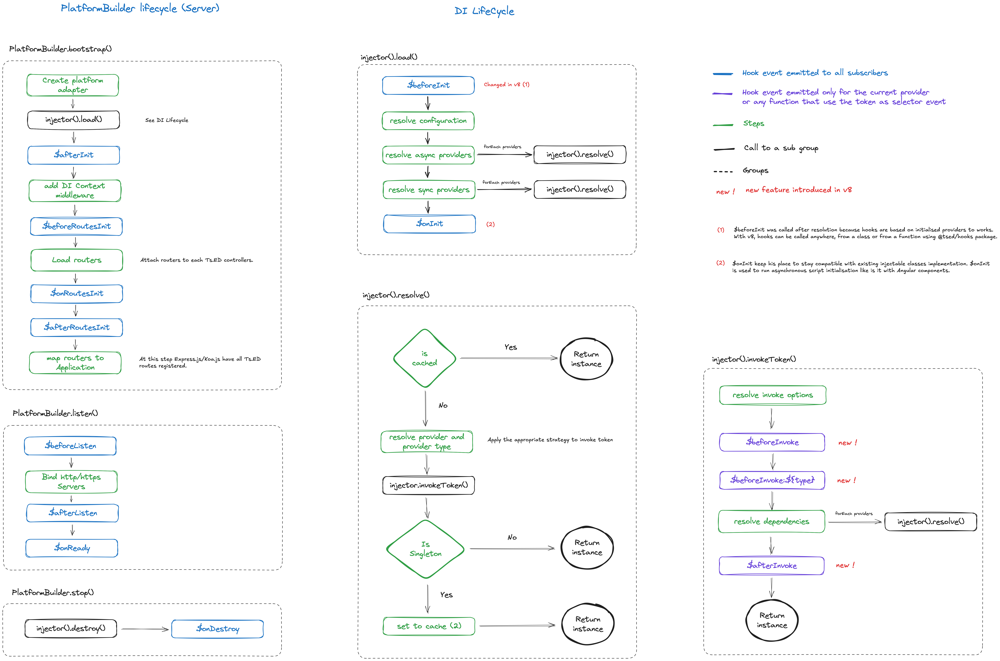

# Hooks

## Introduction

Ts.ED emits different events during its initialization
phase (lifecycle). These lifecycle hooks provide visibility into these key life moments and the ability to act
when they occur.

This schema resume the order of hooks regard to the providers:

[](./assets/hooks-v8.png)

Here is the related code described by the previous schema:

```typescript
async function bootstrap() {
  try {
    const platform = await PlatformExpress.bootstrap(Server);
    await platform.listen();

    process.on("SIGINT", () => {
      platform.stop();
    });
  } catch (error) {
    $log.error({event: "SERVER_BOOTSTRAP_ERROR", message: error.message, stack: error.stack});
  }
}

bootstrap();
```

All providers are called by the emitted `event` and any provider can also emit his own `event`.

::: tip
By convention

- A hook is always prefixed by `$`,
- A hook is emitted from a module,
- A module subscribe to a hook.

:::

## Subscribe to a hook

### Server

You can subscribe to a hook in your Server:

```typescript
import {BeforeInit, Configuration} from "@tsed/di";

@Configuration({})
class Server implements BeforeInit {
  async $beforeInit(): Promise<any> {}
}
```

Since v8, it's possible to use `@tsed/hooks` package to subscribe to hooks:

```typescript
import {$on} from "@tsed/hooks";

$on("$beforeInit", () => {
  // do something
});
```

### Module / Service

You can subscribe to a hook in your @@Module@@ or @@Service@@:

```typescript
import {Module, OnInit} from "@tsed/di";

@Module()
export class MyModule implements OnInit {
  async $onInit(): Promise<any> {}
}
```

Since v8, it's possible to use `@tsed/hooks` package to subscribe to hooks:

```typescript
import {$on} from "@tsed/hooks";

$on("$onInit", () => {
  // do something
});
```

::: tip Note
Database connection can be performed with Asynchronous Provider. See [custom providers](/docs/custom-providers)
:::

### Custom provider

It's also possible to subscribe to a hook in a [custom provider](/docs/custom-providers):

```typescript
import {injectable, constant} from "@tsed/di";
import {DatabaseConnection, Options} from "connection-lib";

export const CONNECTION = injectable<DatabaseConnection>(Symbol.for("CONNECTION"))
  .factory(() => {
    const options = constant<Options>("myOptions");

    return new DatabaseConnection(options);
  })
  .hooks({
    $onDestroy(connection) {
      // called when provider instance is destroyed
      return connection.close();
    }
  })
  .token();
```

It's now easy to close database connection through the `hooks` methods!

## Emit event

Emit event let the developers subscribe and implement his tasks.

```ts
import {Module} from "@tsed/di";
import {$asyncEmit} from "@tsed/hooks";

export interface OnEvent {
  $myEvent(value: string): Promise<void>;
}

@Module()
export class ModuleEmitter {
  async initSomething() {
    // do something before

    await $asyncEmit("$myEvent"); // emit accept extra parameters forwarded to subscribers

    // do something after
  }
}
```

A subscriber:

```typescript
import {Module} from "@tsed/di";
import {OnEvent} from "./ModuleEmitter.js";

@Module()
export class ModuleSubscriber extends OnEvent {
  $alterEvent() {
    // do something
  }
}
```

## Alterable value event

This feature let you emit an event with a value. All providers who subscribe to it can modify the value passed as a
parameter and return a new value which will be passed to the next provider.

```ts
// module-emitter
import {inject, Module, $alterAsync} from "@tsed/di";

export interface AlterEvent {
  $alterEvent(value: string): Promise<string>;
}

@Module()
export class ModuleEmitter {
  async initSomething() {
    // do something before
    const value = $alterAsync("$alterEvent", "hello"); // alterAsync and alter accept extra parameters forwarded to subscribers

    console.log(value); // "hello-world"
    // do something after
  }
}
```

A subscriber:

```typescript
import {Module} from "@tsed/di";
import {AlterEvent} from "./ModuleEmitter.js";

@Module()
export class ModuleSubscriber extends AlterEvent {
  $alterEvent(value: any) {
    return value + " world";
  }
}
```

## Listen token invocation

`$beforeInvoke` and `$afterInvoke` allow you to perform some actions before and after the invocation of the injectable class/factory/async factory.

These hooks can be listened for all tokens or for a specific token:

```typescript
import type {TokenProvider, ResolvedInvokeOptions} from "@tsed/di";
import {$on} from "@tsed/hooks";

// triggered for all tokens
$on("$beforeInvoke", (token: TokenProvider, resolvedOpts: ResolvedInvokeOptions) => {
  // do something
});

// triggered for a specific token

@Injectable()
class MyService {}

$on("$beforeInvoke", MyService, (token: TokenProvider, resolvedOpts: ResolvedInvokeOptions) => {
  // do something
  console.log(token === MyService); // true
});
```

Here is the same example with `$afterInvoke`:

```typescript
import type {TokenProvider, ResolvedInvokeOptions} from "@tsed/di";
import {$on} from "@tsed/hooks";

// triggered for all tokens
$on("$afterInvoke", (instance: unknown, resolvedOpts: ResolvedInvokeOptions) => {
  // do something
});

@Injectable()
class MyService {}

$on("$afterInvoke", MyService, (instance: MyService, resolvedOpts: ResolvedInvokeOptions) => {
  // do something
  console.log(resolvedOpts.token === MyService); // true
  console.log(instance instanceof MyService); // true
});
```

## Listen token instantiation by type

The `$beforeInit:${type}` event can be used to observe the instantiation of a specific @@ProviderType@@.
Currently, Ts.ED framework use this event to build the controller router and attach the router as following:

```typescript
import type {ResolvedInvokeOptions} from "@tsed/di";
import {$on} from "@tsed/hooks";

$on(`$beforeInvoke:${ProviderType.CONTROLLER}`, ({provider, locals}: ResolvedInvokeOptions) => {
  const router = createInjectableRouter(provider as ControllerProvider);
  locals.set(PlatformRouter, router);
});
```

By using this event, Ts.ED attach a router to the controller provider. This action,
let the developer the ability to inject the router in the controller constructor:

```typescript
import {Controller} from "@tsed/di";
import {PlatformRouter} from "@tsed/platform-router";

@Controller("/")
export class MyController {
  constructor(private router: PlatformRouter) {
    router.get("/programmatic", this.programmatic.bind(this));
  }
}
```

## $onInit

The `$onInit` hook is called when all tokens are resolved by the `injector.load()`.
It's the right place to perform asynchronous tasks when you use a class as injectable token.

```typescript
import {Module, OnInit} from "@tsed/di";

@Module()
export class MyModule implements OnInit {
  cachedData: any;

  async $onInit(): Promise<any> {
    this.cachedData = await this.loadData();
  }
}
```

We recommend to use async provider to perform asynchronous tasks. See [custom providers](/docs/custom-providers).

## $onDestroy

The `$onDestroy` hook is called when the provider instance is destroyed. It's the right place to perform cleanup tasks.

```typescript
import {Module, OnDestroy} from "@tsed/di";

@Module()
export class MyModule implements OnDestroy {
  async $onDestroy(): Promise<any> {
    await this.closeConnection();
  }
}
```

## $onRequest and $onResponse

Ts.ED provide a way to intercept the request and response event. You can listen these hooks by implementing a
`$onRequest` and `$onResponse` methods
on an injectable service:

```typescript
import {Module} from "@tsed/di";
import {PlatformContext} from "@tsed/platform-http";

@Module()
class CustomContextModule {
  $onRequest($ctx: PlatformContext) {
    // do something
  }

  $onResponse($ctx: PlatformContext) {
    // do something
  }
}
```

Since v8, it's possible to use `@tsed/hooks` package to subscribe to hooks:

```typescript
import {$on} from "@tsed/hooks";

$on("$onRequest", ($ctx: PlatformContext) => {
  // do something
});

$on("$onResponse", ($ctx: PlatformContext) => {
  // do something
});
```

## $onReady

The `$onReady` hook is called when the server is ready to accept incoming requests.

```typescript
import {Module, OnReady, Inject} from "@tsed/di";

@Module()
export class MyModule implements OnReady {
  async $onReady(): Promise<any> {
    // perform some async tasks
  }
}
```

This hook is useful when you need to perform some async tasks when the server is ready to accept incoming requests.
Also, this hook doesn't block the server startup.
